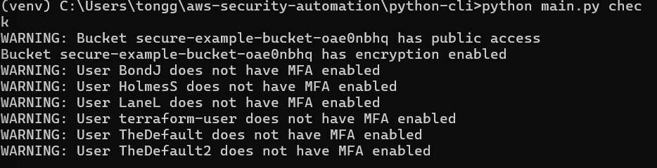

 
# AWS Security Automation Pipeline

A project to deploy secure AWS infrastructure with Terraform and validate it using a Python CLI, built for cloud security engineering.

## Features
- **Terraform**: Deploys a VPC, private S3 bucket, IAM role, and CloudTrail.
- **Python CLI**: Checks S3 encryption, public access (ACLs and policies), and IAM MFA compliance.
- **Security**: Aligns with AWS Well-Architected Framework and CIS Benchmarks.

## Setup (Windows)
1. **Prerequisites**:
   - AWS CLI, Terraform, Python 3.8+, Git.
   - AWS account with AdministratorAccess IAM user.
2. **Deploy Infrastructure**:
   ```cmd
   cd terraform
   terraform init
   terraform apply

## Demo
